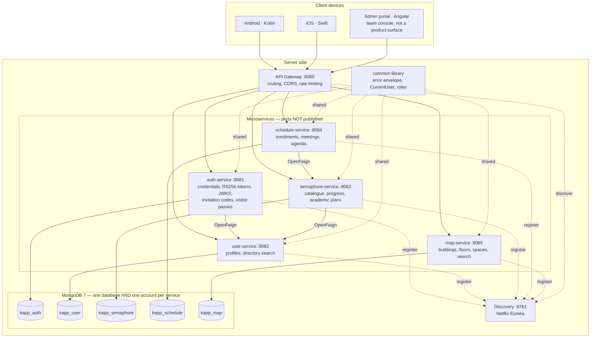
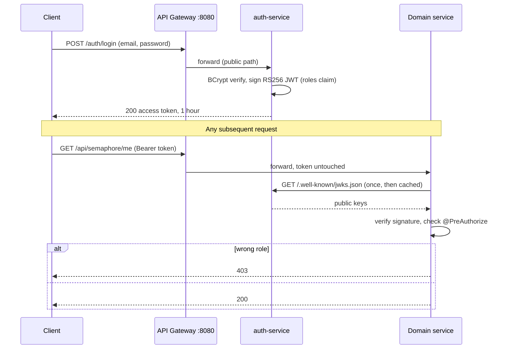

<a id="top"></a>

<table width="100%" style="border: none; background-color: transparent;">
  <tr style="border: none; background-color: transparent;">
    <td align="center" width="20%" style="border: none; padding: 0;">
      
    </td>
    <td align="center" width="80%" style="border: none; padding: 0;">
      
    </td>
  </tr>
</table>

<p align="center"><strong>University mobile app for Fundación Universitaria Konrad Lorenz. Native Android (Kotlin) and iOS (Swift) clients, powered by a Spring Boot microservices backend on MongoDB, with RS256 tokens verified by every service.</strong></p>

<p align="center">
  <a href="https://github.com/K-Forge/KApp/actions/workflows/ci.yml"></a>
  &nbsp;
  <a href="https://kapp-black.vercel.app"></a>
  <br/><br/>
  
  
  
  
  
  
  
  
  
  
</p>

---

## Table of Contents

- [Overview](#overview)
- [Project Status](#project-status)
- [Interface](#interface)
- [System Architecture](#system-architecture)
- [Key Features](#key-features)
- [Tech Stack](#tech-stack)
- [Getting Started](#getting-started)
- [Project Structure](#project-structure)
- [Documentation](#documentation)
- [Security](#security)
- [Contributing](#contributing)
- [Contributors](#contributors)
- [License](#license)

---

## Overview

KApp is the **university mobile application** for the Fundación Universitaria Konrad Lorenz community, developed by
the K-Forge development club. It is a thesis project, and its scope was narrowed deliberately in August 2026 for a
reason worth stating plainly: **the university's academic data is not available**, so the product cannot depend on
it. Accounts are created inside KApp, and the MVP is four things a student uses day to day — **identity and
profile, the campus map, a customisable preloaded timetable, and a customisable preloaded career semáforo**.
Courses, assignments and grading are explicitly out of scope; see [`docs/REQUIREMENTS.md`](docs/REQUIREMENTS.md).

The clients are thin. Everything they consume lives **server-side**: six independent Spring Boot services register
with a Eureka discovery server and are reached through a single API Gateway. **Every service validates the access
token itself** against a published JWKS rather than trusting a header the gateway sets, and each holds its own
MongoDB account with `readWrite` on exactly one database — so the separation between services is enforced by the
engine, not merely respected by the code.

Delivery goes **straight to mobile**. There is a web portal, but it is an administration and development console
for the team — not a product surface. The mobile clients are unblocked: the five OpenAPI contracts are served as
Prism mocks, so Kotlin and Swift work does not wait on the backend.

---

## Project Status

KApp started as an idea intended to become a **degree thesis project**, and it is currently in the
**pre-proposal and documentation phase** (_anteproyecto_).

What that means when reading this repository:

- The research and specification work is the primary deliverable at this stage. It lives in [`docs/`](docs/):
  software requirements specification, functional requirements, system design, and a study of academic database
  models.
- The backend published here is a **working architectural reference prototype**, validated locally. Its purpose is
  to prove that the proposed architecture holds, not to serve production traffic.
- The native clients are **not implemented yet**, by design: `app/frontend/mobile/kotlin/` and
  `app/frontend/mobile/swift/` hold placeholders. The current phase is backend plus the web client that tests it;
  the mobile clients come after the interface design settles, which is why they sit at low priority in
  [docs/PROGRESS.md](docs/PROGRESS.md) despite being the end product.
- There is **no production deployment**. Configuration defaults target local development, and the platform has not
  been hardened for a public-facing environment. See [Security](#security).
- The original Spring Boot monolith was removed once the migration to microservices completed. It remains
  retrievable from the git history; `app/backend/microservices/` is the only backend.

Known gaps are not left implicit. [docs/PROGRESS.md](docs/PROGRESS.md#pending-work) lists the pending work —
governance, presentation, engineering and manual items — with the current state of each and what it needs.

---

## Interface

The web client is where the API is exercised end to end, and it holds the interface design that the Kotlin and
Swift clients will inherit. The screens below run against the microservices backend; the data shown is sample data.

A **live demo** of these screens runs at **[kapp-black.vercel.app](https://kapp-black.vercel.app)** — sign in with
any credentials. It is powered by a demo mode ([`js/demo.js`](app/frontend/web/js/demo.js)) that answers the API
with sample data when no backend is reachable, so the interface can be browsed by anyone. The mode stays inert
during local development — see [Demo mode](#demo-mode).

Captured at phone width (390 x 844), the viewport the layout is designed around: the stylesheets are mobile-first,
and the desktop arrangement is the enhancement layered on top through breakpoints.

<table>
  <tr>
    <td width="20%" align="center" valign="top">
      
      <br/><sub><b>Authentication</b><br/>Institutional credentials, JWT issued by <code>auth-service</code></sub>
    </td>
    <td width="20%" align="center" valign="top">
      
      <br/><sub><b>Dashboard</b><br/>Announcements and role-aware navigation</sub>
    </td>
    <td width="20%" align="center" valign="top">
      
      <br/><sub><b>Courses</b><br/>Enrollment served by <code>course-service</code></sub>
    </td>
    <td width="20%" align="center" valign="top">
      
      <br/><sub><b>Assignments</b><br/>Pending and submitted work from <code>assignment-service</code></sub>
    </td>
    <td width="20%" align="center" valign="top">
      
      <br/><sub><b>Administration</b><br/>User, course and assignment management, admin role only</sub>
    </td>
  </tr>
</table>

---

## System Architecture

The mobile clients run on the user's device; every service runs server-side. **The gateway is the only reachable
component** — service ports are deliberately unpublished — and service locations are resolved through Eureka rather
than hardcoded.



**The gateway does not decide identity.** It routes; each service validates the token's signature itself against
auth-service's published JWKS. Trusting a header the gateway set was a finding in the security audit: anyone able to
reach a service port directly could forge it. A signed token cannot be forged, so the two protections — unpublished
ports and per-service validation — are independent on purpose.



---

## Key Features

- **Single entry point.** All client traffic goes through the gateway; routes are declared explicitly and resolved
  by service id (`lb://user-service`). Eureka's discovery locator is **off**, so registering a service does not
  silently publish it.
- **Per-service token validation.** Every service is an OAuth2 resource server verifying RS256 against a published
  JWKS. Identity comes from the signed token, never from a header.
- **Authorization asserted, not assumed.** Every endpoint carries an explicit rule, and each service's full
  role-by-endpoint matrix is asserted in tests — **including every combination that must be refused**, which are the
  ones that matter.
- **Database isolation the engine enforces.** One database *and one account* per service, each with `readWrite` on
  exactly one. `scripts/verify-db-isolation.sh` proves it in 25 checks.
- **Contract-first.** Five hand-written OpenAPI 3.1 specs, linted in CI and served as Prism mocks, so the mobile
  clients are never blocked on the backend.
- **Versioned migrations.** Mongock change units are ordered, audited and lock-protected, so several developers and
  CI can point at one database without racing.
- **613 integration tests** on Testcontainers, from a repository that had none in August.
- **A campus map drawn from data.** Floors are grids, not photographs — which removed the project's
  longest-lead dependency, since a schematic floor is captured by walking it.

---

## Tech Stack

| Technology | Role | Why this one |
| --- | --- | --- |
| Kotlin (Android) | Primary client | The product's main delivery target. |
| Swift (iOS) | Primary client | Consumes the same gateway API as Android. |
| Java 21 | Backend language | Long-term support release. |
| Spring Boot **3.5** | Service runtime | **Not Boot 4**: Mongock publishes no Boot 4 artifact. |
| Spring Cloud **2025.0** | Distributed layer | The release train for Boot 3.5; 2025.1.x targets Boot 4. |
| Spring Cloud Gateway | Edge routing | One entry point, with an explicit routing table rather than discovery-based exposure. |
| Netflix Eureka | Service discovery | Services are addressed by logical name, not host and port. |
| Spring Security 6.5 (OAuth2 resource server) | Authorization | **RS256** with a published JWKS. A shared symmetric secret handed to six services is six places that can mint an admin token — and Entra ID signs RS256, so that migration becomes a property change. |
| OpenFeign | Inter-service calls | Three edges only, all one-directional. |
| Spring Data MongoDB | Persistence | Document-shaped aggregates with a single writer each. See [ADR 0001](docs/adr/0001-mongodb-over-postgresql.md). |
| **Mongock 5.5.1** | Migrations | Versioned, ordered, audited change units with a distributed lock — which the project previously had none of. |
| MongoDB 7 | Database | One engine, not polyglot. See [ADR 0004](docs/adr/0004-one-database-engine-not-polyglot.md). |
| Testcontainers | Testing | Real MongoDB per suite; no in-memory substitute pretending to be a database. |
| OpenAPI 3.1 + Prism | Contracts | Hand-written, linted in CI, served as mocks so client work never waits. |
| Maven (multi-module) | Build | The parent POM centralises every version, so parallel branches never edit it. |
| Docker + Docker Compose | Containerisation | Profiles (`core`, `academic`, `map`, `full`, `dev`, `cloud`) so a laptop runs only what is needed. |
| Angular 22 + Vitest | Admin portal | A team console, not a product surface. |
| pnpm | Tooling | Repository tooling and the portal's dependencies. |

---

## Getting Started

### Prerequisites

| Requirement | Version | Used for |
| --- | --- | --- |
| Docker Desktop | 4.x+ | **Everything.** MongoDB runs in a container; so do the services and the tests' own database. |
| Java (JDK) | 21 | Only to build or run tests outside Docker. |
| Maven | Use the bundled `./mvnw` | Do not install one. |
| pnpm | 10+ (via Corepack) | Only to develop the admin portal itself. |

There is **no database to install**: Docker Compose starts MongoDB, and the tests start their own
through Testcontainers.

### 1. Clone and install tooling

```bash
git clone https://github.com/K-Forge/KApp.git
cd KApp
corepack enable && corepack prepare pnpm@latest --activate
pnpm install
```

### 2. Configure environment variables

Secrets are **generated on your machine**, not copied from an example file — a password pasted into a chat or a
commit stays in that history forever:

```bash
cd app/backend/microservices
../../../scripts/generate-dev-secrets.sh > .env
```

That writes sixteen values: a MongoDB account per service, the shared internal token, and the signing key id.
`.env` is gitignored and must stay that way.

### 3. Nothing to initialise

Mongock creates every index and loads the seed data — curricula, buildings, spaces, invitation codes — on startup.
`app/database/init.sql` is the legacy PostgreSQL schema, kept for reference only; nothing reads it.

### 4. Start the microservices

```bash
pnpm run microservices:start
```

The script checks prerequisites, starts services in dependency order and polls `/actuator/health` before moving on.

```bash
pnpm run microservices:status
pnpm run microservices:stop
```

### 5. Start the web client

```bash
pnpm run web:start:script
```

Available at `http://localhost:3000`; override with `PORT=4000`.

### Docker Compose alternative

```bash
cd app/backend/microservices
docker compose up --build
```

The compose file expects `PGHOST`, `PGDATABASE`, `PGUSER`, `PGPASSWORD` and `PGSSLMODE` to be exported in the
environment.

### Service ports

| Service            | Port | Responsibility                               |
| ------------------ | ---- | -------------------------------------------- |
| Discovery Server   | 8761 | Eureka service registry.                     |
| API Gateway        | 8080 | Single entry point, routing, JWT validation. |
| Auth Service       | 8081 | Login, registration, token issuing.          |
| User Service       | 8082 | People, members, students and employees.     |
| Course Service     | 8083 | Programs, courses, groups and enrollment.    |
| Assignment Service | 8084 | Assignments, submissions and grading.        |
| Web client         | 3000 | Static frontend.                             |

### Available scripts

| Command                         | Description                                                               |
| ------------------------------- | ------------------------------------------------------------------------- |
| `pnpm run web:dev`              | Serves `app/frontend/web` in development mode.                            |
| `pnpm run web:start`            | Serves the frontend on port 3000 with SPA fallback.                       |
| `pnpm run web:start:script`     | Starts the frontend through `scripts/start-frontend.sh` (honours `PORT`). |
| `pnpm run microservices:start`  | Starts all microservices in order, with health checks.                    |
| `pnpm run microservices:status` | Reports which microservices are running.                                  |
| `pnpm run microservices:stop`   | Stops the microservices started by the script.                            |

Older aliases `dev:web`, `start:web`, `start:frontend` and `start:microservices` are kept for backwards
compatibility.

### Demo mode

The backend is not hosted anywhere, so a plain static deployment of the web client would show a login screen that
can never authenticate. [`app/frontend/web/js/demo.js`](app/frontend/web/js/demo.js) closes that gap: it intercepts
the API calls and answers them with sample data, letting a visitor sign in with any credentials and walk through the
student, professor and administrator views.

It activates **only when the client is served from a host other than `localhost`**, so local development keeps
talking to the real microservices and nothing about the normal workflow changes. To exercise it locally, append
`?demo=1` (and `?demo=0` to leave it):

```bash
pnpm run web:start   # then open http://localhost:3000/login.html?demo=1
```

A persistent banner marks every screen as demo data, and offers a role switcher so the administrator panel is
reachable without credentials.

### Deploying the web demo

[`vercel.json`](vercel.json) configures the repository as a static deployment of `app/frontend/web`, with no build
step and a baseline set of security headers. With the Vercel CLI authenticated:

```bash
vercel link
```

```bash
vercel deploy --prod
```

Linking the repository from the Vercel dashboard works as well; the configuration file is picked up automatically,
and the framework preset should be left as "Other".

---

## Project Structure

```
KApp/
├── app/
│   ├── backend/
│   │   ├── microservices/          # Active backend — Maven multi-module project
│   │   │   ├── discovery-server/   # Eureka registry (:8761)
│   │   │   ├── api-gateway/        # Routing, JWT filter, CORS, circuit breakers (:8080)
│   │   │   ├── auth-service/       # Authentication and token issuing (:8081)
│   │   │   ├── user-service/       # User and profile management (:8082)
│   │   │   ├── course-service/     # Courses, groups and enrollment (:8083)
│   │   │   ├── assignment-service/ # Assignments, submissions, grading (:8084)
│   │   │   ├── common/             # Shared DTOs and global exception handling
│   │   │   ├── docker-compose.yml  # Containerized topology
│   │   │   └── pom.xml             # Parent POM (dependency and version management)
│   │   └── postman/                # API collections (Admin CRUD, user flows)
│   ├── frontend/
│   │   ├── web/                    # Web client used to test the API (HTML/CSS/JS)
│   │   │   ├── css/                # base, layout and shell stylesheets
│   │   │   ├── js/app.js           # Client logic: session, routing, API access
│   │   │   ├── js/demo.js          # Sample-data mode for backend-less deployments
│   │   │   └── images/             # Static assets
│   │   └── mobile/
│   │       ├── kotlin/             # Android client (planned)
│   │       └── swift/              # iOS client (planned)
│   └── database/
│       ├── init.sql                # Schema: enums, tables, triggers, audit_log
│       ├── test_data.sql           # Sample data — development only
│       └── delete_all_data.sql     # Database reset helper
├── docs/                           # Specification, design and research
│   └── researches/                 # Academic article reviews (PDF)
├── scripts/                        # Local orchestration scripts (bash)
├── assets/                         # Branding assets
│   └── screenshots/                # Interface captures used in this README
├── .github/workflows/ci.yml        # Build pipeline (JDK 21, Maven)
├── vercel.json                     # Static deployment of the web client
├── AGENTS.md                       # Operational context for AI agents
├── LICENSE                         # Internal use license
└── package.json                    # Repository tooling and scripts
```

---

## Documentation

| Document                                                   | Content                                               |
| ---------------------------------------------------------- | ----------------------------------------------------- |
| [docs/SRS.md](docs/SRS.md)                                 | Software requirements specification.                  |
| [docs/REQUIREMENTS.md](docs/REQUIREMENTS.md)               | Functional and non-functional requirements.           |
| [docs/DESIGN.md](docs/DESIGN.md)                           | System and interface design decisions.                |
| [docs/MICROSERVICES-IDEAS.md](docs/MICROSERVICES-IDEAS.md) | Service decomposition analysis.                       |
| [docs/DOCKER-GUIDE.md](docs/DOCKER-GUIDE.md)               | Container setup and operation guide.                  |
| [docs/PROGRESS.md](docs/PROGRESS.md)                       | Implementation progress and the explicit list of pending work. |
| [docs/K-COLORS.md](docs/K-COLORS.md)                       | Brand color palette.                                  |
| [docs/SECURITY-AUDIT.md](docs/SECURITY-AUDIT.md)           | Security audit findings and public-release checklist. |
| [docs/researches/](docs/researches/)                       | Academic research: article reviews on university mobile apps and student engagement (ScienceDirect, Taylor & Francis, Scopus). |
| [AGENTS.md](AGENTS.md)                                     | Repository context and rules for AI agents.           |

---

## Security

This repository is published for reading and technical evaluation. **Nothing here is deployed**: there is no server,
no hosted environment and no user data. The configuration targets local development and has not been hardened —
role-based authorization is not enforced, CORS is permissive, and domain services trust identity headers set by the
gateway.

Rather than leave that implicit, the prototype was audited against itself and the findings written down:
[docs/SECURITY-AUDIT.md](docs/SECURITY-AUDIT.md) lists every issue with severity, evidence at file and line, and the
remediation each one needs. It doubles as the design checklist for the planned re-architecture. Secrets are read
from environment variables (see [.env.example](.env.example)) and the working tree carries no credential literal;
two development credentials from the deleted monolith remain readable in the git history and are recorded there.

To report a vulnerability, follow the security policy published by the
[K-Forge organization](https://github.com/K-Forge) or write to kforge.dev@gmail.com. Please do not open a public
issue for security reports.

---

## Contributing

Maintenance of this codebase is restricted to authorized members of K-Forge and the Fundación Universitaria Konrad
Lorenz. External pull requests are not accepted.

Contribution guidelines, issue templates and the security policy are maintained at the organization level in
[K-Forge/.github](https://github.com/K-Forge) and apply to this repository.

Repository-specific rules for authorized members:

- Branch naming follows `feature/*` and `bugfix/*`; commits follow the Conventional Commits specification.
- Any schema change must be reflected in `app/database/init.sql`.
- Backend work targets `app/backend/microservices/`. The web client under `app/frontend/web/` is the test surface for
  that API and the reference design for the future Kotlin and Swift clients: keep its screens in sync with what the
  mobile apps are meant to deliver.

---

## Contributors

Thanks to the club members who forge and drive this software project.

<table>
  <tr>
    <td align="center"><a href="https://github.com/13rianVargas"><br /><sub><b>Brian Vargas</b></sub></a></td>
    <td align="center"><a href="https://github.com/JulianAvila259"><br /><sub><b>Julian Avila </b></sub></a></td>
    <td align="center"><a href="https://github.com/SantiagoRR17"><br /><sub><b>Santiago Rocha</b></sub></a></td>
    <td align="center"><a href="https://github.com/DIEGO-ALI"><br /><sub><b>Diego Lares</b></sub></a></td>
  </tr>
</table>

---

## License

This repository is **source-available, not open source**. The source code is public for reading, study and technical
evaluation; it is not licensed for reuse.

Use, modification and redistribution are restricted under the [Internal Use License](LICENSE), which limits the
software to authorized members of the Fundación Universitaria Konrad Lorenz and the K-Forge development club.
The Spanish text of `LICENSE` is the binding version.

© 2025-2026 K-Forge Developers. All rights reserved.

---

<div align="center">
  <br>
  <a href="https://github.com/K-Forge">
    
  </a>
  &nbsp;
  <a href="https://kforge.vercel.app">
    
  </a>
  &nbsp;
  <a href="mailto:kforge.dev@gmail.com">
    
  </a>
  <br><br>
  <sub>Forged by <a href="https://github.com/K-Forge"><strong>K-Forge</strong></a> — development club of Fundación Universitaria Konrad Lorenz</sub>
  <br><br>
  <a href="#top">
    
  </a>
  <br><br>
  
</div>
