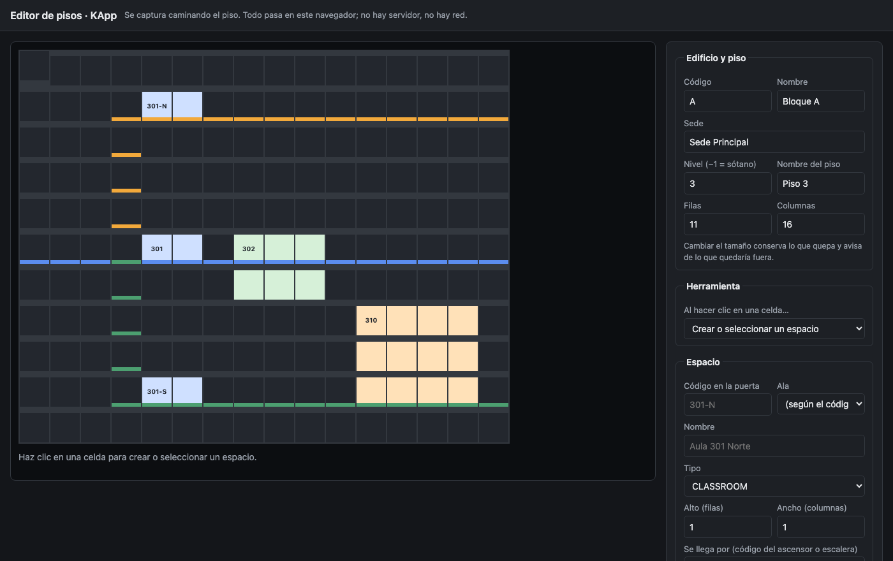
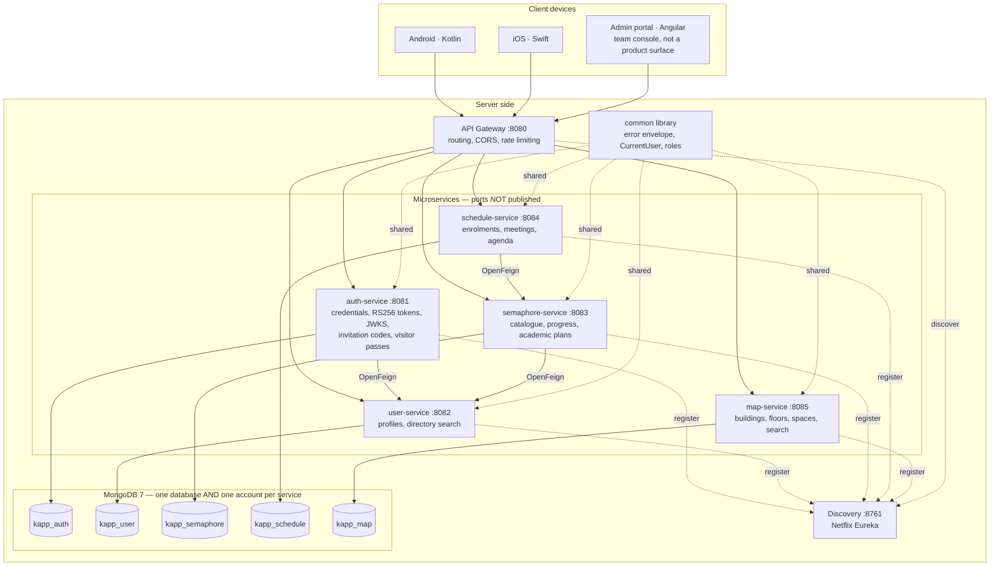
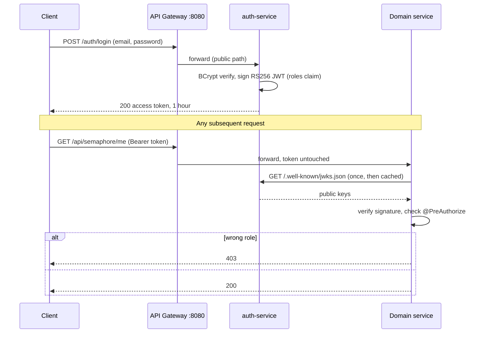

<a id="top"></a>

<table width="100%" style="border: none; background-color: transparent;">
  <tr style="border: none; background-color: transparent;">
    <td align="center" width="20%" style="border: none; padding: 0;">
      
    </td>
    <td align="center" width="80%" style="border: none; padding: 0;">
      
    </td>
  </tr>
</table>

<p align="center"><strong>University mobile app for Fundación Universitaria Konrad Lorenz. Native Android (Kotlin) and iOS (Swift) clients, powered by a Spring Boot microservices backend on MongoDB, with RS256 tokens verified by every service.</strong></p>

<p align="center">
  <a href="https://github.com/K-Forge/KApp/actions/workflows/ci.yml"></a>
  &nbsp;
  <a href="https://kapp-black.vercel.app"></a>
  <br/><br/>
  
  
  
  
  
  
  
  
  
  
</p>

---

## Table of Contents

- [Overview](#overview)
- [Project Status](#project-status)
- [Interface](#interface)
- [System Architecture](#system-architecture)
- [Key Features](#key-features)
- [Tech Stack](#tech-stack)
- [Getting Started](#getting-started)
- [Project Structure](#project-structure)
- [Documentation](#documentation)
- [Security](#security)
- [Contributing](#contributing)
- [Contributors](#contributors)
- [License](#license)

---

## Overview

KApp is the **university mobile application** for the Fundación Universitaria Konrad Lorenz community, developed by
the K-Forge development club. It is a thesis project, and its scope was narrowed deliberately in August 2026 for a
reason worth stating plainly: **the university's academic data is not available**, so the product cannot depend on
it. Accounts are created inside KApp, and the MVP is four things a student uses day to day — **identity and
profile, the campus map, a customisable preloaded timetable, and a customisable preloaded career semáforo**.
Courses, assignments and grading are explicitly out of scope; see [`docs/REQUIREMENTS.md`](docs/REQUIREMENTS.md).

The clients are thin. Everything they consume lives **server-side**: six independent Spring Boot services register
with a Eureka discovery server and are reached through a single API Gateway. **Every service validates the access
token itself** against a published JWKS rather than trusting a header the gateway sets, and each holds its own
MongoDB account with `readWrite` on exactly one database — so the separation between services is enforced by the
engine, not merely respected by the code.

Delivery goes **straight to mobile**. There is a web portal, but it is an administration and development console
for the team — not a product surface. The mobile clients are unblocked: the five OpenAPI contracts are served as
Prism mocks, so Kotlin and Swift work does not wait on the backend.

---

## Project Status

KApp is a **degree thesis project**, due **November 2026**, built by six people in their spare time.

What that means when reading this repository:

- **The backend is built and tested.** Five services, **613 integration tests** on Testcontainers,
  from a repository that had none in August. Every service asserts its full role-by-endpoint
  authorization matrix — including every combination that must be refused, which are the ones that
  matter.
- **The native clients are the product, and they have not been started.** They are unblocked: the
  five OpenAPI contracts are served as Prism mocks, so Kotlin and Swift work does not wait on the
  backend.
- **The scope was narrowed deliberately** in August 2026, because the university's academic data is
  not available. Courses, assignments and grading are out — not pending.
  [`docs/REQUIREMENTS.md`](docs/REQUIREMENTS.md) says what is in and what is out, with nothing left
  implicit.
- **There is no production deployment.** It runs on the lead developer's machine until university
  hardware exists, and it has not been hardened for a public network. See [Security](#security).
- **What is blocked, and on whom**, is listed in [`docs/PROGRESS.md`](docs/PROGRESS.md) — an Atlas
  cluster, an SMTP relay, an Entra ID application registration, one sketched floor, and the 24
  pensums as CSV.
- The original Spring Boot monolith was removed once the migration completed. It remains retrievable
  from the git history; `app/backend/microservices/` is the only backend.

---

## Interface

**The product's screens do not exist yet.** The Android and iOS clients are the deliverable and they
have not been built; showing mockups here as if they were shipped would be the wrong impression to
leave. What exists today are the two tools the team uses to build it.

### The floor editor

This is how a floor of the campus gets captured: walk it, count the squares, mark the lifts and
stairs, trace the corridors in the colour they are actually painted, place the rooms. One
self-contained HTML file — no server, no network, no build.

It matters more than a tool usually would. The map used to be modelled as a photograph of an
architectural plan, and obtaining those plans depended on other people's calendars — it was the
project's longest-lead item and the one most likely to slip before November. A schematic floor is
captured in an afternoon by the people who need it.
[ADR 0006](docs/adr/0006-schematic-map-not-floor-plan-images.md) records the trade.

<p align="center">
  
  <br/>
  <sub>Floor 3 of Bloque A, loaded from the seed. The three <b>301</b> rooms — north, central and
  south — are three different rooms sharing one base code, which is the case most likely to send a
  student to the wrong door. Corridors run in the colours the wings are painted; the auditorium
  spans several cells. The editor refuses a room that would not fit or that would overlap another,
  so a mistake surfaces while somebody is still standing in the building.</sub>
</p>

```bash
open app/backend/microservices/map-service/src/main/resources/static/admin/grid-editor.html
```

### The admin and developer console

An Angular portal at `localhost:4300`: CRUD over programs, curricula, users, buildings, spaces,
invitation codes and visitor passes; bulk pensum import; an API console driven by the OpenAPI specs
themselves; and a role inspector showing what each role may reach. It is a **team console, not a
product surface** — nothing a student ever sees.

```bash
cd app/backend/microservices && docker compose --profile core --profile dev up -d
```

### The frozen prototype

An earlier plain HTML/JS client is still in the tree at `app/frontend/web/`, and the **[live
demo](https://kapp-black.vercel.app)** runs it. It shows courses, assignments and grading — none of
which is being built any more. It is kept as the interface study it was, not as a description of the
product; see [`docs/REQUIREMENTS.md`](docs/REQUIREMENTS.md) for what is and is not in scope.

---

## System Architecture

The mobile clients run on the user's device; every service runs server-side. **The gateway is the only reachable
component** — service ports are deliberately unpublished — and service locations are resolved through Eureka rather
than hardcoded.



**The gateway does not decide identity.** It routes; each service validates the token's signature itself against
auth-service's published JWKS. Trusting a header the gateway set was a finding in the security audit: anyone able to
reach a service port directly could forge it. A signed token cannot be forged, so the two protections — unpublished
ports and per-service validation — are independent on purpose.



---

## Key Features

- **Single entry point.** All client traffic goes through the gateway; routes are declared explicitly and resolved
  by service id (`lb://user-service`). Eureka's discovery locator is **off**, so registering a service does not
  silently publish it.
- **Per-service token validation.** Every service is an OAuth2 resource server verifying RS256 against a published
  JWKS. Identity comes from the signed token, never from a header.
- **Authorization asserted, not assumed.** Every endpoint carries an explicit rule, and each service's full
  role-by-endpoint matrix is asserted in tests — **including every combination that must be refused**, which are the
  ones that matter.
- **Database isolation the engine enforces.** One database *and one account* per service, each with `readWrite` on
  exactly one. `scripts/verify-db-isolation.sh` proves it in 25 checks.
- **Contract-first.** Five hand-written OpenAPI 3.1 specs, linted in CI and served as Prism mocks, so the mobile
  clients are never blocked on the backend.
- **Versioned migrations.** Mongock change units are ordered, audited and lock-protected, so several developers and
  CI can point at one database without racing.
- **613 integration tests** on Testcontainers, from a repository that had none in August.
- **A campus map drawn from data.** Floors are grids, not photographs — which removed the project's
  longest-lead dependency, since a schematic floor is captured by walking it.

---

## Tech Stack

| Technology | Role | Why this one |
| --- | --- | --- |
| Kotlin (Android) | Primary client | The product's main delivery target. |
| Swift (iOS) | Primary client | Consumes the same gateway API as Android. |
| Java 21 | Backend language | Long-term support release. |
| Spring Boot **3.5** | Service runtime | **Not Boot 4**: Mongock publishes no Boot 4 artifact. |
| Spring Cloud **2025.0** | Distributed layer | The release train for Boot 3.5; 2025.1.x targets Boot 4. |
| Spring Cloud Gateway | Edge routing | One entry point, with an explicit routing table rather than discovery-based exposure. |
| Netflix Eureka | Service discovery | Services are addressed by logical name, not host and port. |
| Spring Security 6.5 (OAuth2 resource server) | Authorization | **RS256** with a published JWKS. A shared symmetric secret handed to six services is six places that can mint an admin token — and Entra ID signs RS256, so that migration becomes a property change. |
| OpenFeign | Inter-service calls | Three edges only, all one-directional. |
| Spring Data MongoDB | Persistence | Document-shaped aggregates with a single writer each. See [ADR 0001](docs/adr/0001-mongodb-over-postgresql.md). |
| **Mongock 5.5.1** | Migrations | Versioned, ordered, audited change units with a distributed lock — which the project previously had none of. |
| MongoDB 7 | Database | One engine, not polyglot. See [ADR 0004](docs/adr/0004-one-database-engine-not-polyglot.md). |
| Testcontainers | Testing | Real MongoDB per suite; no in-memory substitute pretending to be a database. |
| OpenAPI 3.1 + Prism | Contracts | Hand-written, linted in CI, served as mocks so client work never waits. |
| Maven (multi-module) | Build | The parent POM centralises every version, so parallel branches never edit it. |
| Docker + Docker Compose | Containerisation | Profiles (`core`, `academic`, `map`, `full`, `dev`, `cloud`) so a laptop runs only what is needed. |
| Angular 22 + Vitest | Admin portal | A team console, not a product surface. |
| pnpm | Tooling | Repository tooling and the portal's dependencies. |

---

## Getting Started

### Prerequisites

| Requirement | Version | Used for |
| --- | --- | --- |
| Docker Desktop | 4.x+ | **Everything.** MongoDB runs in a container; so do the services and the tests' own database. |
| Java (JDK) | 21 | Only to build or run tests outside Docker. |
| Maven | Use the bundled `./mvnw` | Do not install one. |
| pnpm | 10+ (via Corepack) | Only to develop the admin portal itself. |

There is **no database to install**: Docker Compose starts MongoDB, and the tests start their own
through Testcontainers.

### 1. Clone and install tooling

```bash
git clone https://github.com/K-Forge/KApp.git
cd KApp
corepack enable && corepack prepare pnpm@latest --activate
pnpm install
```

### 2. Configure environment variables

Secrets are **generated on your machine**, not copied from an example file — a password pasted into a chat or a
commit stays in that history forever:

```bash
cd app/backend/microservices
../../../scripts/generate-dev-secrets.sh > .env
```

That writes sixteen values: a MongoDB account per service, the shared internal token, and the signing key id.
`.env` is gitignored and must stay that way.

### 3. Nothing to initialise

Mongock creates every index and loads the seed data — curricula, buildings, spaces, invitation codes — on startup.
`app/database/init.sql` is the legacy PostgreSQL schema, kept for reference only; nothing reads it.

### 4. Start the microservices

```bash
pnpm run microservices:start
```

The script checks prerequisites, starts services in dependency order and polls `/actuator/health` before moving on.

```bash
pnpm run microservices:status
pnpm run microservices:stop
```

### 5. Start the web client

```bash
pnpm run web:start:script
```

Available at `http://localhost:3000`; override with `PORT=4000`.

### Docker Compose alternative

```bash
cd app/backend/microservices
docker compose up --build
```

The compose file expects `PGHOST`, `PGDATABASE`, `PGUSER`, `PGPASSWORD` and `PGSSLMODE` to be exported in the
environment.

### Service ports

| Service            | Port | Responsibility                               |
| ------------------ | ---- | -------------------------------------------- |
| Discovery Server   | 8761 | Eureka service registry.                     |
| API Gateway        | 8080 | Single entry point, routing, JWT validation. |
| Auth Service       | 8081 | Login, registration, token issuing.          |
| User Service       | 8082 | People, members, students and employees.     |
| Course Service     | 8083 | Programs, courses, groups and enrollment.    |
| Assignment Service | 8084 | Assignments, submissions and grading.        |
| Web client         | 3000 | Static frontend.                             |

### Available scripts

| Command                         | Description                                                               |
| ------------------------------- | ------------------------------------------------------------------------- |
| `pnpm run web:dev`              | Serves `app/frontend/web` in development mode.                            |
| `pnpm run web:start`            | Serves the frontend on port 3000 with SPA fallback.                       |
| `pnpm run web:start:script`     | Starts the frontend through `scripts/start-frontend.sh` (honours `PORT`). |
| `pnpm run microservices:start`  | Starts all microservices in order, with health checks.                    |
| `pnpm run microservices:status` | Reports which microservices are running.                                  |
| `pnpm run microservices:stop`   | Stops the microservices started by the script.                            |

Older aliases `dev:web`, `start:web`, `start:frontend` and `start:microservices` are kept for backwards
compatibility.

### Demo mode

The backend is not hosted anywhere, so a plain static deployment of the web client would show a login screen that
can never authenticate. [`app/frontend/web/js/demo.js`](app/frontend/web/js/demo.js) closes that gap: it intercepts
the API calls and answers them with sample data, letting a visitor sign in with any credentials and walk through the
student, professor and administrator views.

It activates **only when the client is served from a host other than `localhost`**, so local development keeps
talking to the real microservices and nothing about the normal workflow changes. To exercise it locally, append
`?demo=1` (and `?demo=0` to leave it):

```bash
pnpm run web:start   # then open http://localhost:3000/login.html?demo=1
```

A persistent banner marks every screen as demo data, and offers a role switcher so the administrator panel is
reachable without credentials.

### Deploying the web demo

[`vercel.json`](vercel.json) configures the repository as a static deployment of `app/frontend/web`, with no build
step and a baseline set of security headers. With the Vercel CLI authenticated:

```bash
vercel link
```

```bash
vercel deploy --prod
```

Linking the repository from the Vercel dashboard works as well; the configuration file is picked up automatically,
and the framework preset should be left as "Other".

---

## Project Structure

```
KApp/
├── app/
│   ├── backend/
│   │   ├── microservices/            # The backend — Maven multi-module project
│   │   │   ├── discovery-server/     # Eureka registry (:8761)
│   │   │   ├── api-gateway/          # Routing, CORS, rate limiting (:8080) — the only open port
│   │   │   ├── auth-service/         # Credentials, RS256 tokens, JWKS, invitation codes,
│   │   │   │                         #   visitor passes (:8081)
│   │   │   ├── user-service/         # Profiles and directory search (:8082)
│   │   │   ├── semaphore-service/    # Catalogue, student progress, academic plans (:8083)
│   │   │   ├── schedule-service/     # Enrolments, meetings, agenda (:8084)
│   │   │   ├── map-service/          # Buildings, floors, spaces, search (:8085)
│   │   │   │   └── src/main/resources/static/admin/grid-editor.html   # The floor editor
│   │   │   ├── common/               # Error envelope, CurrentUser, role constants
│   │   │   ├── course-service/       # FROZEN — out of the reactor, compose and CI
│   │   │   ├── assignment-service/   # FROZEN — same
│   │   │   ├── mongo-init/rs-init.js # Replica set, service accounts, and the health probe
│   │   │   ├── docker-compose.yml    # Profiles: mock, core, academic, map, full, dev, cloud
│   │   │   └── pom.xml               # Parent POM — every version lives here
│   │   └── postman/                  # API collections
│   ├── frontend/
│   │   ├── web-admin/                # Admin and developer console (Angular 22)
│   │   ├── web/                      # FROZEN prototype — the live demo runs this
│   │   └── mobile/
│   │       ├── kotlin/               # Android client — the product, not started
│   │       └── swift/                # iOS client — the product, not started
│   └── database/init.sql             # Legacy PostgreSQL schema. Reference only; nothing reads it
├── docs/
│   ├── api/                          # Five OpenAPI 3.1 contracts — the source of truth
│   ├── adr/                          # Architecture decision records
│   ├── templates/                    # The pensum import CSV and its column reference
│   ├── PROGRESS.md                   # What is built, and what is blocked on whom
│   ├── RUNBOOK.md                    # How to start, stop and troubleshoot it
│   ├── SECURITY-AUDIT.md             # Findings S1–S12 and what closed each
│   ├── REQUIREMENTS.md · DESIGN.md   # Scope and architecture
│   └── ATLAS-SETUP.md                # Standing up the shared development cluster
├── scripts/
│   ├── generate-dev-secrets.sh       # Writes .env — secrets never leave the machine
│   ├── create-dev-accounts.sh        # The four team accounts
│   ├── verify-db-isolation.sh        # Proves each service reaches its own database and no other
│   └── verify-visitor-pass.py        # End-to-end check of the day pass through the gateway
├── .github/workflows/ci.yml          # Backend, contracts and portal
├── AGENTS.md                         # Operational context for AI agents
└── package.json                      # Repository tooling
```

---

## Documentation

**Start here** depending on what you came for:

| Document | Content |
| --- | --- |
| [docs/ONBOARDING.md](docs/ONBOARDING.md) | **Start here on a new machine.** Ten minutes, in Spanish, no Java or MongoDB to install. |
| [docs/RUNBOOK.md](docs/RUNBOOK.md) | **How to run it.** Profiles, accounts, and a troubleshooting section where every entry is a failure we actually hit. |
| [docs/PROGRESS.md](docs/PROGRESS.md) | **What is built**, what each phase delivered, and what is blocked on whom. |
| [docs/api/](docs/api/) | The five OpenAPI 3.1 contracts. **The source of truth** — linted in CI and served as mocks. |
| [docs/adr/](docs/adr/) | Architecture decision records: what was decided, what else was considered, and the consequences including the bad ones. |
| [docs/REQUIREMENTS.md](docs/REQUIREMENTS.md) | Scope. Every entry is built or explicitly out — no pending requirements nobody intends to implement. |
| [docs/DESIGN.md](docs/DESIGN.md) | The system as it is, with diagrams. |
| [docs/SECURITY-AUDIT.md](docs/SECURITY-AUDIT.md) | Findings S1–S12, what closed each, and what must happen before this is reachable from outside. |
| [docs/ATLAS-SETUP.md](docs/ATLAS-SETUP.md) | Standing up the shared development cluster. |
| [docs/templates/](docs/templates/) | The pensum import CSV and its column reference. |
| [docs/INTEGRATION-NOTES.md](docs/INTEGRATION-NOTES.md) | Findings worth carrying forward — the kind that cost a day to learn. |
| [docs/SRS.md](docs/SRS.md) | The original software requirements specification. Predates the August narrowing. |
| [docs/MICROSERVICES-IDEAS.md](docs/MICROSERVICES-IDEAS.md) | Service decomposition analysis. Ideas, not commitments. |
| [docs/DOCKER-GUIDE.md](docs/DOCKER-GUIDE.md) · [docs/K-COLORS.md](docs/K-COLORS.md) | Container guide; brand palette. |
| [docs/researches/](docs/researches/) | Academic article reviews on university mobile apps and student engagement. |
| [AGENTS.md](AGENTS.md) | Repository context and rules for AI agents. |

---

## Security

**Nothing here is deployed**: no server, no hosted environment, no user data. It runs on one laptop.

The prototype was audited against itself in August and the findings written down, with severity, evidence at file
and line, and what each needed: [docs/SECURITY-AUDIT.md](docs/SECURITY-AUDIT.md). **That description used to say
role-based authorization was not enforced, CORS was permissive, and services trusted an identity header set by the
gateway. All three were findings, and all three are closed** — every service now validates the token itself, every
endpoint carries an explicit rule asserted per role in tests, and the CORS wildcard is an allow-list.

Three findings remain open, deliberately, and each says what has to happen before KApp is reachable from outside a
laptop:

- **S7** — tokens simply expire after an hour; there is no refresh and no revocation.
- **S11** — the four development accounts hold `ROLE_ADMIN`, and the two seeded invitation codes ship in this
  repository. Both are correct while this runs on one machine and **must be revoked before it does not**.
- **H1** — two development credentials from the deleted monolith remain readable in the git history.

Secrets are generated per machine by `scripts/generate-dev-secrets.sh` and never committed; the working tree carries
no credential literal.

KApp stores one piece of personal data: the identity document a visitor presents for a day pass. It is readable only
by an administrator and **deleted automatically after 30 days** by a database TTL index —
[ADR 0007](docs/adr/0007-visitor-day-pass-instead-of-guest-accounts.md) records the Ley 1581 obligations and how each
is met.

To report a vulnerability, follow the security policy published by the
[K-Forge organization](https://github.com/K-Forge) or write to kforge.dev@gmail.com. Please do not open a public
issue for security reports.

---

## Contributing

Maintenance of this codebase is restricted to authorized members of K-Forge and the Fundación Universitaria Konrad
Lorenz. External pull requests are not accepted.

Contribution guidelines, issue templates and the security policy are maintained at the organization level in
[K-Forge/.github](https://github.com/K-Forge) and apply to this repository.

Repository-specific rules for authorized members:

- Branch naming follows `feature/*` and `bugfix/*`; commits follow the Conventional Commits specification.
- Any schema change must be reflected in `app/database/init.sql`.
- Backend work targets `app/backend/microservices/`. The web client under `app/frontend/web/` is the test surface for
  that API and the reference design for the future Kotlin and Swift clients: keep its screens in sync with what the
  mobile apps are meant to deliver.

---

## Contributors

Thanks to the club members who forge and drive this software project.

<table>
  <tr>
    <td align="center"><a href="https://github.com/13rianVargas"><br /><sub><b>Brian Vargas</b></sub></a></td>
    <td align="center"><a href="https://github.com/JulianAvila259"><br /><sub><b>Julian Avila </b></sub></a></td>
    <td align="center"><a href="https://github.com/SantiagoRR17"><br /><sub><b>Santiago Rocha</b></sub></a></td>
    <td align="center"><a href="https://github.com/DIEGO-ALI"><br /><sub><b>Diego Lares</b></sub></a></td>
  </tr>
</table>

---

## License

This repository is **source-available, not open source**. The source code is public for reading, study and technical
evaluation; it is not licensed for reuse.

Use, modification and redistribution are restricted under the [Internal Use License](LICENSE), which limits the
software to authorized members of the Fundación Universitaria Konrad Lorenz and the K-Forge development club.
The Spanish text of `LICENSE` is the binding version.

© 2025-2026 K-Forge Developers. All rights reserved.

---

<div align="center">
  <br>
  <a href="https://github.com/K-Forge">
    
  </a>
  &nbsp;
  <a href="https://kforge.vercel.app">
    
  </a>
  &nbsp;
  <a href="mailto:kforge.dev@gmail.com">
    
  </a>
  <br><br>
  <sub>Forged by <a href="https://github.com/K-Forge"><strong>K-Forge</strong></a> — development club of Fundación Universitaria Konrad Lorenz</sub>
  <br><br>
  <a href="#top">
    
  </a>
  <br><br>
  
</div>
