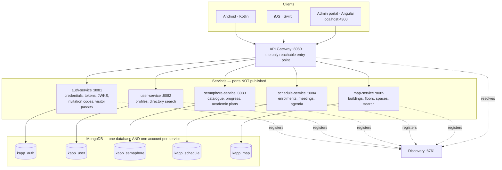
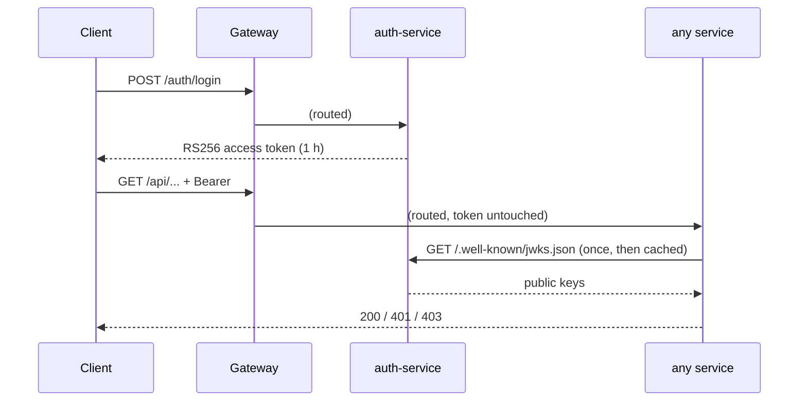
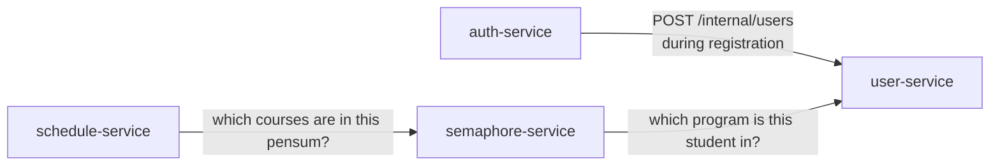
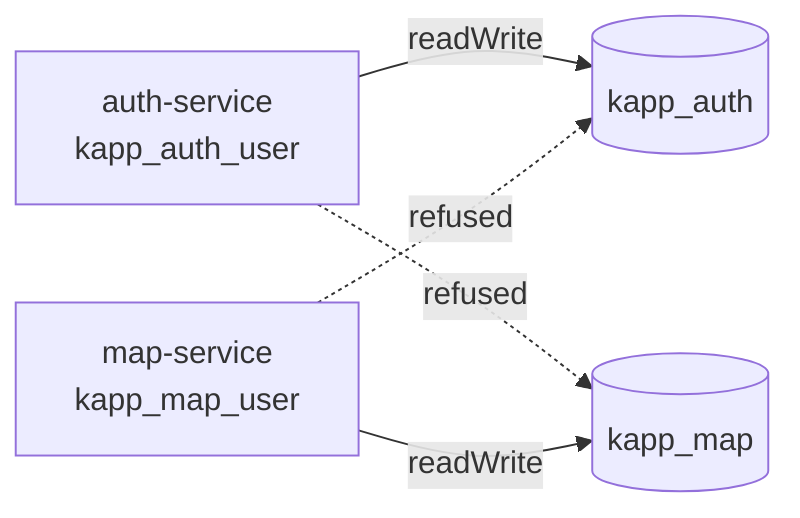

# KApp · Design

> Last updated: 5 September 2026.
> Supersedes the February 2026 version, which described a PostgreSQL/JPA system with HS512 tokens
> and services that no longer run.

This describes what exists. For *why* a decision was taken, see [`adr/`](adr/) — the decision table
that used to live here has been replaced by those records, because a table of decisions with no
reasoning is the part people stop trusting first.

---

## 1. Shape of the system

Six services behind one gateway. The clients are native mobile apps; the web portal is an
administration and development console for the team, not a product surface.

**Service ports 8081–8085 are deliberately unpublished.** Being able to reach a service directly was
finding S1. Every service also validates the token itself, so reaching one would gain nothing even
if the port were open — the two protections are independent on purpose.

---

## 2. Stack

| Layer | Technology | Note |
|---|---|---|
| Runtime | Java 21, Spring Boot **3.5.16** | Not Boot 4: Mongock publishes no Boot 4 artifact |
| Cloud | Spring Cloud **2025.0.3** | The train for Boot 3.5. 2025.1.x targets Boot 4 |
| Discovery | Netflix Eureka | |
| Gateway | Spring Cloud Gateway (WebFlux) | Explicit routing table; the discovery locator is **off** (S4) |
| Security | Spring Security 6.5, OAuth2 resource server | **RS256** with a published JWKS — [ADR 0002](adr/0002-rs256-with-a-published-jwks.md) |
| IPC | OpenFeign | Three edges only — see §4 |
| Persistence | Spring Data MongoDB | One engine — [ADR 0004](adr/0004-one-database-engine-not-polyglot.md) |
| Migrations | Mongock 5.5.1 | `@EnableMongock` is **mandatory**: it ships no auto-configuration |
| Contracts | OpenAPI 3.1, hand-written, linted in CI | Served as Prism mocks so client work never waits |
| Tests | JUnit 5 + Testcontainers | 613 integration tests |
| Portal | Angular 22, Vitest, pnpm | |
| Mobile | Kotlin (Android), Swift (iOS) | The product. Unblocked by the mocks |

---

## 3. Identity

**The gateway does not decide identity.** It routes; each service validates the signature itself.
That is what closes S1: a forged header buys nothing, because the token is signed and the service
checks it.

**`jwk-set-uri`, never `issuer-uri`.** `issuer-uri` performs OIDC discovery at bean creation, which
deadlocks startup: every service would need auth-service up before it could start, including on a
cold `docker compose up`. The keys are fetched lazily on the first authenticated request, which is
why that one request can be slow and the second is not.

### Roles

| | map | catalogue | own semáforo | own timetable | own profile | administration |
|---|---|---|---|---|---|---|
| `ROLE_GUEST` (visitor pass) | ✅ | ❌ | ❌ | ❌ | ❌ | ❌ |
| `ROLE_STUDENT` | ✅ | ✅ | ✅ | ✅ | ✅ | ❌ |
| `ROLE_PROFESSOR` | ✅ | ✅ | ❌ | ✅ | ✅ | ❌ |
| `ROLE_ADMIN` | ✅ | ✅ | ❌ | ✅ | ✅ | ✅ |

A professor has **no semáforo**: they have no academic record of their own. An administrator reads a
student's through `GET /api/semaphore/{userId}`, which never accepts `"me"` as an identity source.

Every cell in that table is asserted by a test, including every ❌ — those are the ones that matter.

---

## 4. Service-to-service calls

Three edges, all synchronous OpenFeign, all one-directional:

**There are deliberately no more.** Two things the mockups suggested were left to the client
instead:

- *"Next class"* — `GET /api/schedule/me/day` already returns the day in order; the client picks the
  next one from its own clock.
- *"Courses in your plan not yet in your timetable"* — the client has both screens. Crossing them
  locally avoids a fourth edge and, more importantly, means the timetable still loads when the
  semáforo is down.

`POST /internal/users` is reachable only from inside the compose network, carries a shared internal
token, and **has no gateway route at all**.

---

## 5. Data model, in one paragraph each

**auth** — `credentials` (one per account, BCrypt, verification token stored hashed),
`invitation_codes` (redeemed by an atomic `findAndModify` guarded on the quota, so two simultaneous
registrations cannot both take the last use), `visitor_passes` (with a **TTL index** that deletes
each record 30 days after redemption — [ADR 0007](adr/0007-visitor-day-pass-instead-of-guest-accounts.md)).

**user** — `users`, with pre-computed `searchTokens` so accent-insensitive search is an index hit
rather than a regex scan. MongoDB 7 reports `IXSCAN` for an unanchored case-insensitive regex while
walking the whole index; the assertion to make is about bounds and documents examined, not the stage
name.

**semaphore** — `programs`, `curricula` (a pensum with its courses, areas and prerequisite graph),
`studentProgress` (one document per student, materialised lazily on first read), and
`academicPlans`, which stores **only the courses a student moved**. The pensum stays immutable; the
plan is a thin layer over it, so a correction to the published pensum reaches every plan without
rewriting any.

**schedule** — `enrollments` and `meetings`, with overlap detection in the domain.

**map** — `buildings` (floors embedded, since nothing queries a floor without knowing its building)
and `spaces` (a flat collection, because the primary access pattern is "find a room anywhere"). A
floor is a **grid**, not a plan image — [ADR 0006](adr/0006-schematic-map-not-floor-plan-images.md).

---

## 6. Database isolation

Each service holds an account with `readWrite` on exactly one database, created **inside** that
database so the database is also its `authSource` — a leaked connection string opens one database
and does not name the others. `scripts/verify-db-isolation.sh` proves it: 25 checks, each account
against every database. [ADR 0005](adr/0005-per-service-database-credentials.md).

---

## 7. Where the decisions live

| Decision | Record |
|---|---|
| MongoDB rather than PostgreSQL | [ADR 0001](adr/0001-mongodb-over-postgresql.md) |
| RS256 with a published JWKS | [ADR 0002](adr/0002-rs256-with-a-published-jwks.md) |
| OIDC rather than SAML | [ADR 0003](adr/0003-oidc-over-saml-for-mobile-authentication.md) |
| One engine, not polyglot | [ADR 0004](adr/0004-one-database-engine-not-polyglot.md) |
| One account per service | [ADR 0005](adr/0005-per-service-database-credentials.md) |
| A schematic map, not floor plan images | [ADR 0006](adr/0006-schematic-map-not-floor-plan-images.md) |
| A visitor day pass, not guest accounts | [ADR 0007](adr/0007-visitor-day-pass-instead-of-guest-accounts.md) |

Findings and their fixes: [`SECURITY-AUDIT.md`](SECURITY-AUDIT.md).
What is built and what is blocked on whom: [`PROGRESS.md`](PROGRESS.md).
How to run it: [`RUNBOOK.md`](RUNBOOK.md).
